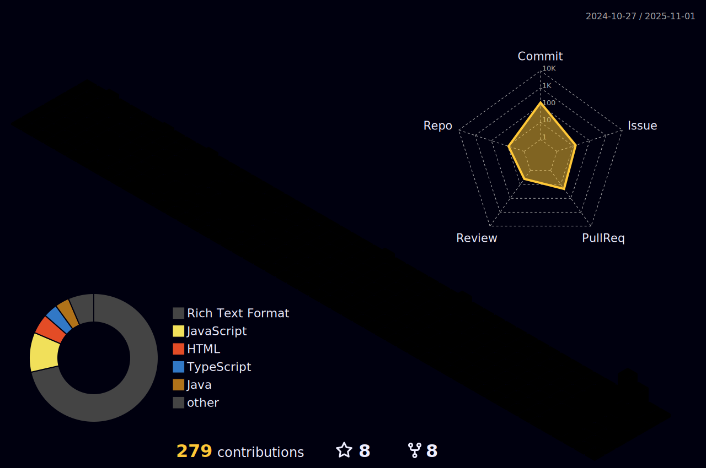

<p align="center">
  
</p>

<div align="center" >
<h1> ABOUT ME</h1>
 </div>

```yaml
name: Shambhavee Srivastava
located_in: Dehradun, Uttarakhand
education:
  [
    "Self-Taught Developer",
    "A Web-dev and DevOps Enthusiast"
    "Bachelor's in Computer Engineering",
  ]


fields_of_interests:
  [
    "Web Development",
    "DevOps",
    "Machine Learning",
    "Cloud Computing"
    "UI/UX",
  ]
   
currently_learning: ["Prometheus, Grafana and TypeScript"]
2024 Goals: ["Create 25+ Projects and learn at least 5-10 new Technologies."]
hobbies: ["Swimming","Sketching","Content Writer"]
```

<div align="center" >
<h1> CONNECT WITH ME</h1>
 </div>

[](shambhaveesrivastava12@gmail.com)
[](www.linkedin.com/in/shambhavee-srivastava-973494278)  [](https://leetcode.com/Shambhaveesrivastava34)   [](https://www.hackerrank.com/shaaamzz90)


<div align="center" >
<h1>  TECH STACK</h1>
 </div>
 
                                          


<div align="center" >
<h1>  GITHUB STATS</h1>
 </div>
<p></p>
<hr>

[](https://holopin.io/@shambhaveesrivastava12)


<div align="center" >
<h1> CONTRIBUTIONS</h1>
 </div>

        

<div align="center">

</div>

<p align="center">
   
</p>
